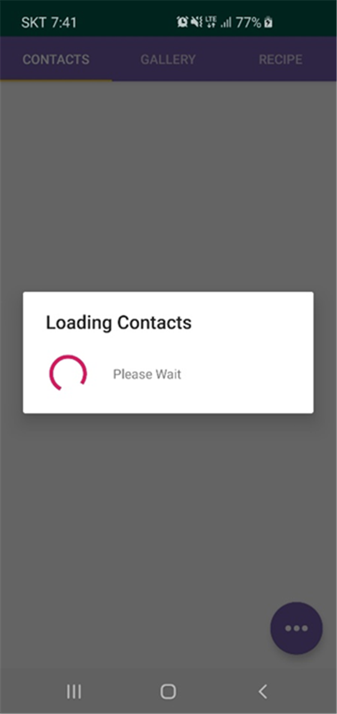

# 안드로이드 node.js 연습용 어플리케이션

![Language][language-java]
![Language][language-javascript]
![Library][library-nodejs]
![Platform][platform-android]
![Database][database-mongodb]
 
![Participants][participants-duo]
 
[![School Project][kaist-image]][kaist-cs-url]
![Course][course-cs496]
![Grade][grade-p]

> 로컬 연락처와 사진의 추가, 수정, 삭제, 서버와의 동기화 기능을 제공하고 DB에 저장된 레시피 정보를 가져와 레시피를 이름과 태그로 검색할 수 있는 어플리케이션입니다.

## 스크린샷

## 라이선스 및 공동체 수정

이곳은 개인 프로젝트 백업을 목적으로 하는 저장소입니다.

  * 모든 제3자 사용을 허가하지 않습니다.
  * 모든 제3자 수정을 승인하지 않습니다.
    * 깃허브 Pull Request를 받지 않습니다.

<!-- Image definitions -->
[kaist-image]: https://img.shields.io/badge/Institution-KAIST-blue
[kaist-cs-url]: https://cs.kaist.ac.kr
[course-cs496]: https://img.shields.io/badge/Course-Immersion%20Camp%3A%20Intensive%20Programming%20and%20Startup-brightgreen
[language-java]: https://img.shields.io/badge/Language-Java-orange
[language-javascript]: https://img.shields.io/badge/Language-JavaScript-orange
[library-nodejs]: https://img.shields.io/badge/Library-Node.js-green
[platform-android]: https://img.shields.io/badge/Platform-Android-yellowgreen
[database-mongodb]: https://img.shields.io/badge/Database-mongoDB-ff80a0
[grade-p]: https://img.shields.io/badge/Grade-P-yellow
[participants-duo]: https://img.shields.io/badge/Participants-Duo%20Project-7aa3cc
